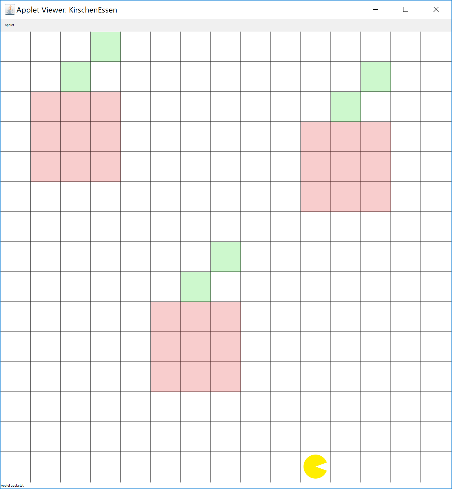
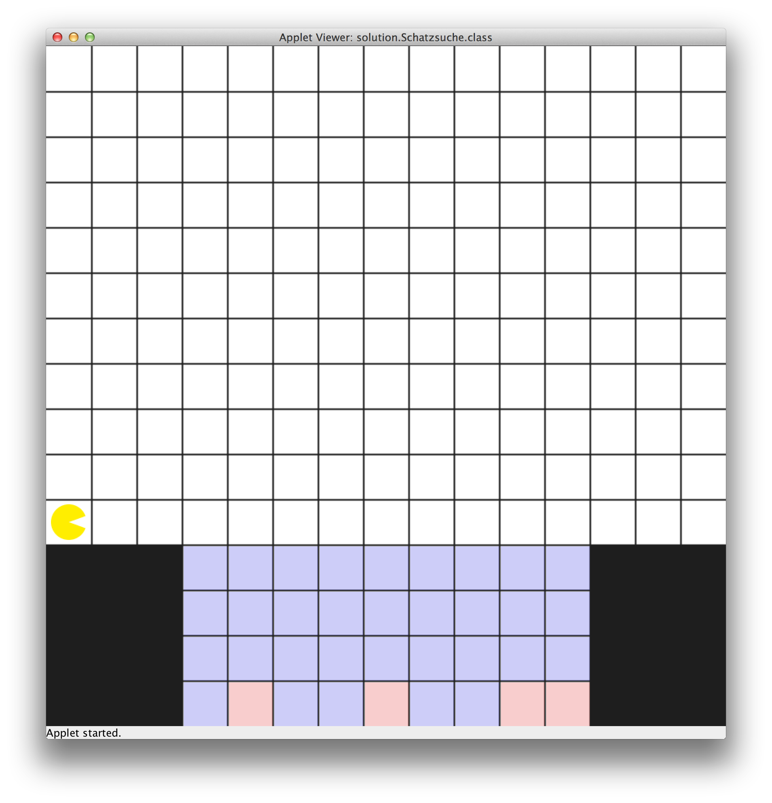
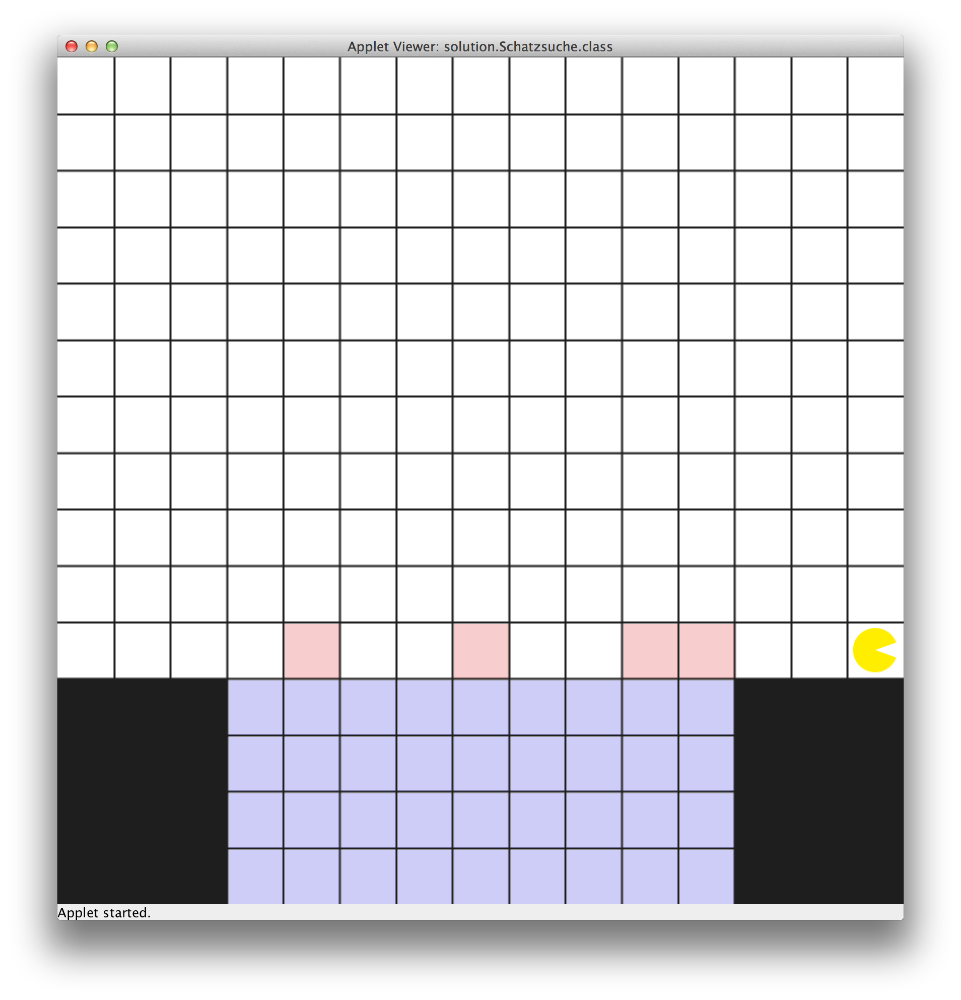
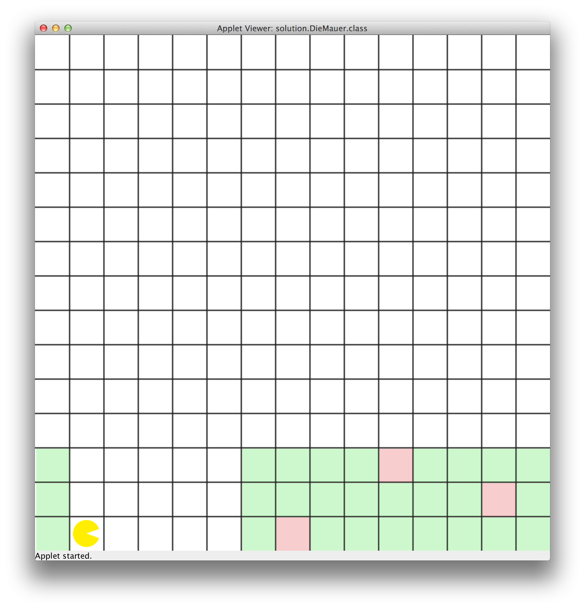

# Mehr von Bouncer

## Wichtige Informationen zur Bearbeitung der Aufgabe 
 - [Informationen zur Entwicklungsumgebung *IntelliJ IDEA*](https://elearning.uni-regensburg.de/mod/book/view.php?id=1480675)
 - [Informationen zum Im- und Export von Projekten](https://elearning.uni-regensburg.de/mod/book/view.php?id=1480675&chapterid=51551)
 - [Bouncer](https://elearning.uni-regensburg.de/mod/book/view.php?id=1480680/)

## Starterpaket

Ein vorbereitetes Starterpaket zur selbständigen Implementierung der Aufgabe finden Sie [hier](https://github.com/OOP-Ubungen-WS2020-21/U02-Mehr-von-Bouncer/archive/Loesung.zip).

## **Bouncer hat Hunger**

{ width=50% }

In dieser Aufgabe liegen in Bouncers Welt einige Kirschen, die Bouncer
sich vorknöpfen möchte. Schreiben Sie ein Programm, mit dem Sie jede
Zelle der Karte auf Kirscheninhalte überprüfen und gegebenenfalls weiss
färben (= essen). Sie müssen eine Lösung programmieren, die für Karten
mit beliebig verteilten Kirschen funktioniert. Achten Sie darauf, nicht
den Stiel mit zu essen, das bekommt Bouncer nicht gut.

Die Aufgabe besteht darin, die Kommandos für Bouncer zu schreiben, um
die folgenden Teilaufgaben zu lösen.

1.  Ablaufen der Zeilen/Spalten

2.  Detektion und Essen der Kirschenfelder

**Hinweise:** Schreiben Sie eine eigene `private`-Methoden für jeden der
oben dargestellten Schritte. Identifizieren Sie Teilprobleme, die Sie auf weitere Methoden aufteilen.
 Beachten Sie dabei die, in der Vorlesung
angesprochenen Verfahren des Top-Down-Ansatzes sowie der Decomposition.
Achten Sie darauf, sowohl den Code als auch die Kommentare (z.B. *pre*-
und *post-conditions*) in Englisch zu schreiben. Verwenden Sie
aussagekräftige Bezeichnungen für Ihre eigenen Methoden.

## **Bouncer auf Schatzsuche**

{ width=50% }

{ width=50% }

Bouncer steht in dieser Aufgabe vor einem See, in dem eine Reihe von
versunkenen Schätze auf dem Grund liegen (*rote Felder*). Bouncers
Aufgabe ist es, zu diesen Schätzen zu tauchen, sie an die Oberfläche des Sees zu befördern und dort treiben zu lassen. Dazu muss Bouncer den gesamten Grund des Sees untersuchen, jeden Schatz aufnehmen (*Das rote
Feld blau einzeichnen*) und mit den einzelnen Schätzen senkrecht nach
oben tauchen. Über der Wasseroberfläche soll Bouncer den gefunden Schatz
ablegen (*Das entsprechende Feld rot färben)*. Die Schätze liegen immer
auf dem Grund des Sees, es können allerdings unterschiedliche viele sein
und ihre Position ist unbekannt. Sie müssen eine Lösung programmieren,
die für beliebige Karten funktioniert. Links und rechts vom See befindet
sich dabei immer ein drei Felder breites Ufer - die Tiefe des Sees ist
nicht bekannt, über der Wasseroberfläche ist aber immer mindestens ein
Feld bis zum oberen Kartenrand frei. Zu Beginn startet Bouncer am linken
Ufer und am Ende soll er den rechten Kartenrand erreichen (Siehe
Grafik).

Die Aufgabe besteht daraus, die Kommandos für Bouncer zu schreiben, um
die folgenden Teilaufgaben zu lösen.

1.  Eintauchen in den See

2.  Durchsuchen des Seegrunds nach Schätzen

3.  Bergen der einzelnen Schätze, in dem diese an die Oberfläche
    gebracht werden

4.  Auftauchen aus dem See und erreichen des rechten Ufers.

**Hinweise:** Schreiben Sie eine eigene `private`-Methode für jeden der
oben dargestellten Schritte. Teilen Sie die identifizierten Teilprobleme
nötigen Falles auf weitere Methoden auf. Beachten Sie dabei die, in der
Vorlesung angesprochenen Verfahren des Top-Down-Ansatzes sowie der
Decomposition. Achten Sie darauf, sowohl den Code als auch die
Kommentare (z.B. *pre*- und *post-conditions*) in Englisch zu schreiben.
Verwenden Sie aussagekräftige Bezeichnungen für Ihre eigenen Methoden.
Ein Tipp: Das Bergen eines einzelnen Schatzes unterbricht die größere
Aufgabe des Suchens auf dem Seegrund. Nach dem erfolgreichen Bergen muss
Bouncer die Suche nach den anderen Schätzen an der richtigen Stelle
fortsetzen.

## **Bouncer repariert eine Mauer**

 

{ width=50% }

In dieser Aufgabe soll Bouncer eine Mauer reparieren. Höhe der Mauer und
Anzahl der beschädigten Felder sind dabei unbekannt. Bouncer weiß nur,
dass die linke Seite der Mauer - die erste Spalte - immer intakt ist.
Intakte Teile der Mauer sind grün eingefärbt, die zu reparierenden
Felder rot. Zur Reparatur steht Bouncer ein ausreichend großer Stapel an
*Ersatzsteinen* zur Verfügung. Bouncers Aufgabe ist es, die Mauer nach
den beschädigten Felder abzusuchen. Findet er ein solches Felder,
repariert er es. Dazu muss er zum Stapel mit den Ersatzteilen laufen
einen Stein aufnehmen und mit diesem die beschädigte Stelle reparieren.
Dabei wird immer der oberste Stein ausgewählt. Wenn Bouncer mit einem
neuen Stein zur Mauer zurückkehrt, läuft er direkt in die *Zeile*, in
der er die beschädigte Stelle gefunden hat.

Da wir mit Bouncer einen solchen Prozesse nur simulieren können, müssen
Sie ein wenig Phantasie mitbringen: Das Reparieren eines Feldes passiert
durch das Einfärben der Stelle mit grüner Farbe. Das Aufnehmen eines
Steines vom Stapel können Sie durch das Löschen der grünen Farbe an
dieser Stelle darstellen (`bouncer.clearFieldColor()`). Alle
Arbeitsabläufe sollen sichtbar am Bildschirm dargestellt werden.

**Hinweise:** Wenn Sie dieses Problem gemäß der Aufgabenstellung lösen
wollen, werden Sie merken, dass es sich um ein komplexes Programm
handelt. Möglicherweise können Sie den nötigen Algorithmus auf Basis
Ihres aktuellen Wissens nicht aufstellen. Es handelt sich explizit um
eine optionale Aufgabe, an der Sie *tüfteln* können.

Als Hilfestellung können Sie von folgenden Teilproblemen ausgehen, die
im Rahmen des Programms gelöst werden müssen.

1.  Bouncer muss von der Startposition bis zur Mauer gelangen, diese
    reparieren und am Ende auf der Mauer zum stehen kommen.

2.  Für die Reparatur untersucht Bouncer die Mauer *zeilenweise*. Findet
    er eine beschädigte Stelle, beginnt er mit der Reparatur.
    Anschließend setzt er die Untersuchung der Mauer fort.

3.  Die Reparatur besteht aus mehreren Schritten: Bouncer muss zum
    Stapel laufen und dort einen Stein aufnehmen. Danach kehrt er in die
    *Zeile* der Mauer zurück, in der die beschädigte Stelle gefunden
    wurde und repariert diese. Dabei soll er direkt in die entsprechende
    Zeile zurückkehren und nicht jedes mal die komplette Mauer
    durchlaufen müssen.

4.  Bouncer muss sich den Weg zur aktuellen Zeile merken. Denken Sie
    daran, dass er Felder farbig markieren und auch wieder *entfärben*
    kann. Versuchen Sie den jeweils korrekten Weg zwischen Mauerzeile
    und Stapel mit dieser Methodik zu kennzeichnen.

